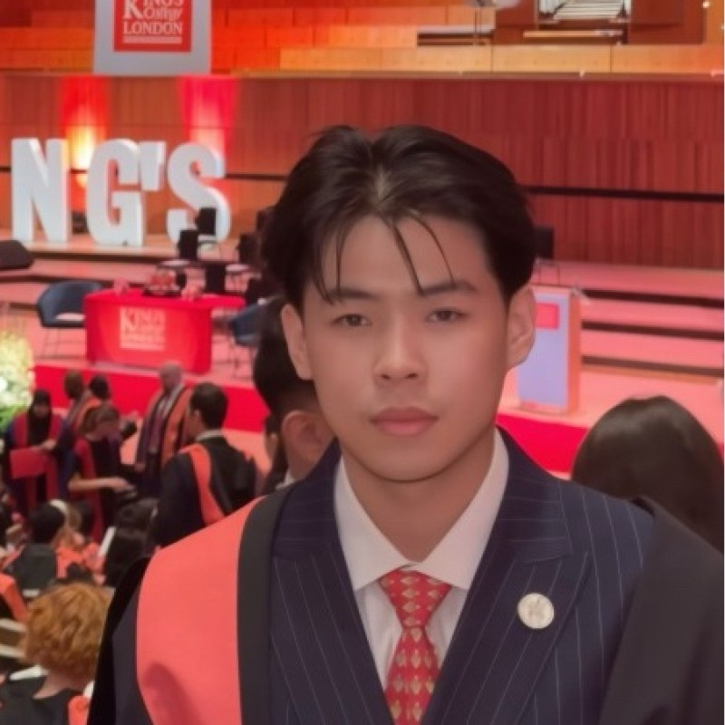

# Hi, I'm Richard 👋

Founding engineer at a 15-person startup, owning distributed backend systems end-to-end from architecture through on-call. Shipped AWS event-driven pipelines sustaining 14M-record peak bursts across ~1B structured planning data fields, LLM classification infrastructure at ~90% accuracy, and internal AI agents that cut scraper-failure triage from a week to a day.

---

## 🛠 Tech Stack

**Languages**

**Distributed Systems**

**Backend & Data**

**AI/ML**

**DevOps**

**Frontend**

---

## 🚀 Featured Projects

### 🏭 Tier 1: Production & Full-Stack

- **Serac Group** — Founding Software Engineer (Jan 2025 – Present). Event-driven AWS pipelines sustaining 14M-record peak bursts at 99.9% SLA. LLM classification over ~1B fields at ~90% accuracy. AI agents cutting scraper-failure triage from 1 week to 1 day. Reduced AWS spend ~28%.
- **[emulsion](https://github.com/richard7ao/emulsion)** — Full-stack portfolio platform: Rust/Axum API, SwiftUI iOS app, SQLite WAL, FTS5 search, DashMap caching, UniFFI shared types.
- **[e-commerce](https://github.com/richard7ao/e-commerce)** — Full-stack e-commerce platform: Next.js, Payload CMS, Stripe integration.

### 🔬 Tier 2: Research & Side Projects

- **[PharmaBridge](https://github.com/richard7ao/national-med-tech-foundation-hackathon)** — 🥈 2nd Place, Imperial College x National MedTech Foundation Hackathon (Apr 2026). Full-stack B2B pharmacy exchange (Next.js, Node.js, PostgreSQL). Team Captain & Lead Engineer.
- **[gym-cooking](https://github.com/richard7ao/gym-cooking)** — Multi-agent reinforcement learning in resource-scarce cooking environments. Final-year dissertation at King's College London. Python, PyTorch, OpenAI Gym.
- **AI Triage Nurse** — AI-powered emergency triage agent for simulated A&E. Streamlit UI, OpenReward environment, reinforcement learning.
- **[golf-seg](https://github.com/richard7ao/golf-seg)** — Personal finance tracker with budget management, transaction logging, and gamification. Django.

### 🎓 Tier 3: CS Fundamentals & Academic

- **Compiler Pipeline** ([lexer-parser](https://github.com/richard7ao/cfl-lexer-parser) → [JVM backend](https://github.com/richard7ao/cfl-compiler) → [LLVM backend](https://github.com/richard7ao/cfl-llvm)) — Full compiler for the While/Fun languages: lexer, recursive descent parser, JVM bytecode via Jasmin, LLVM IR backend. Scala.
- **[scala-functional](https://github.com/richard7ao/scala-functional)** — Functional programming: regex engine, Wordle solver, Knights Tour, Brainfuck interpreter. Scala.
- **[cpp-data-structures](https://github.com/richard7ao/cpp-data-structures)** — Data structures and algorithms: linked lists, tree maps, Sudoku solvers, search strategies. C++.

### ⚡ Tier 4: Hackathon Projects

- **[cursor-hackathon-2026-04-30](https://github.com/richard7ao/cursor-hackathon-2026-04-30)** — Cursor AI hackathon (TypeScript)
- **[vercel-hackathon-2026-05-01](https://github.com/richard7ao/vercel-hackathon-2026-05-01)** — Vercel platform hackathon
- **[cursor-x-briefcase-hackathon](https://github.com/richard7ao/cursor-x-briefcase-hackathon)** — Cursor × Briefcase collaborative hackathon
- **[hackathon-tools](https://github.com/richard7ao/hackathon-tools)** — Reusable tooling and utilities for rapid hackathon development
- **[Hackathon-Practice](https://github.com/richard7ao/Hackathon-Practice)** — Rapid prototyping playground

---

## 📊 GitHub Stats

---

## 🔭 Currently Building

- **Emulsion** — Expanding the portfolio platform with conversations, inbox system, and cross-platform shared types via UniFFI
- **Serac** — Scaling event-driven pipelines and LLM classification infrastructure

---

## 🤝 Connect With Me

- 💼 [LinkedIn](https://linkedin.com/in/richard7ao)
- 🌐 [Portfolio](https://richard7ao-portfolio.vercel.app)
- 📧 [richard@seractech.co.uk](mailto:richard@seractech.co.uk)

---

⭐ *If you find my work interesting, feel free to star and fork my repositories!*

**Made with ❤️ in London** | Last Updated: May 2026

